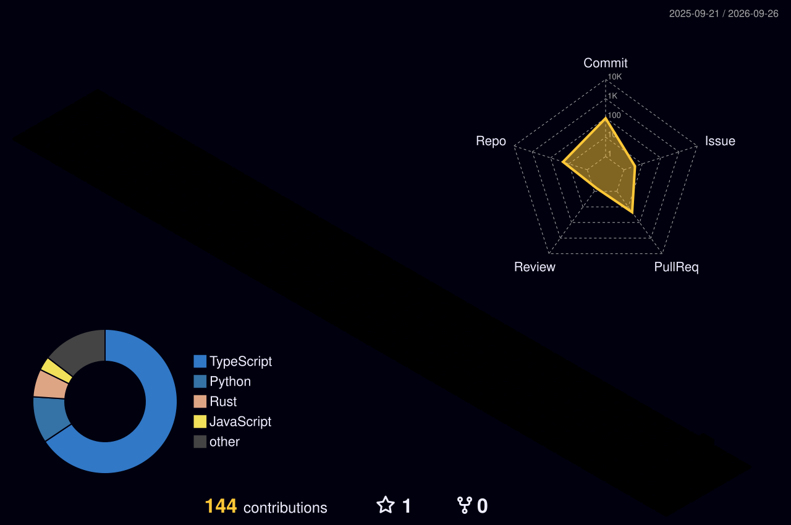

<div align="center">

# 👋 Hey, I'm Ishan Kumar


<br/>


</div>

---

## ⚡ About Me

```typescript
const ishan = {
  role: "Developer & Builder",
  focus: ["Software Engineering", "AI", "Product Building"],
  languages: ["Python", "TypeScript", "JavaScript"],
  mindset: "Learn → Build → Ship → Improve",
  currentlyBuilding: true
};
```

- 💻 Turning ideas into working software
- 🧠 Learning by building real-world projects
- 🚀 Interested in products, startups and modern technology
- ⚡ Constantly experimenting, improving and shipping

---

## 🧠 Tech Arsenal

<div align="center">


</div>

---

## 🚀 Featured Builds

<table>
<tr>

<td width="50%" valign="top">

### 🤖 InterviewOS

AI-powered technical interview experience focused on adaptive interviews and candidate evaluation.

**`TypeScript` `AI` `Web`**

[Explore Project →](https://github.com/ishan-one8/interviewos-vicodathon)

</td>

<td width="50%" valign="top">

### 🏏 Hand Cricket

Interactive terminal-based Hand Cricket game built using Python.

**`Python` `Game Logic`**

[Explore Project →](https://github.com/ishan-one8/Hand-Cricket-Game)

</td>

</tr>

<tr>

<td width="50%" valign="top">

### 📊 Student Marks Analyser

Python project for analysing and understanding student performance.

**`Python` `Data`**

[Explore Project →](https://github.com/ishan-one8/Student-Marks-Analyser)

</td>

<td width="50%" valign="top">

### 🏏 Cricket Score Analysis

Cricket data exploration and score analysis project.

**`Python` `Analytics`**

[Explore Project →](https://github.com/ishan-one8/Cricket-Score-Analysis)

</td>

</tr>
</table>

---

<div align="center">

### `while (alive) { learn(); build(); ship(); improve(); }`

</div>
---
---

## 🌌 Contribution Universe

<div align="center">



</div>

## 🐍 Contribution Trail

<div align="center">

<picture>
  <source
    media="(prefers-color-scheme: dark)"
    srcset="https://raw.githubusercontent.com/ishan-one8/ishan-one8/gh-pages/github-snake-dark.svg"
  />
  <source
    media="(prefers-color-scheme: light)"
    srcset="https://raw.githubusercontent.com/ishan-one8/ishan-one8/gh-pages/github-snake.svg"
  />
  
</picture>

</div>
---

<div align="center">

### ⚡ Build. Ship. Learn. Repeat.


<br/><br/>

<sub>Turning ideas into software, one commit at a time.</sub>

</div>
